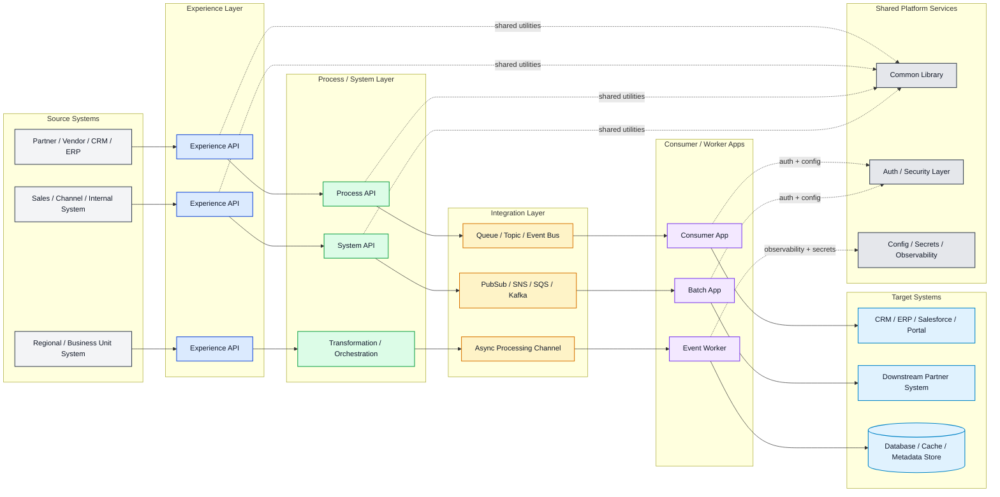

# Reusable Architecture Pattern for New Projects

This is the general design pattern to reuse for new integrations or platform projects. It follows the same structure as the COIC-style architecture but uses generic names so it can be applied to other products.

## Design pattern summary

This architecture follows a repeatable pattern for integration-heavy platforms:

1. Source systems push or pull data.
2. Experience APIs receive external requests.
3. Process and system APIs transform and orchestrate the work.
4. Queues or event buses decouple synchronous and asynchronous processing.
5. Consumer or worker apps complete business operations.
6. Downstream systems are updated with the final results.
7. Shared platform functions handle auth, secrets, logging, and common business utilities.

## When to use this pattern

Use this pattern when your project includes any of the following:

- external API integrations
- system-to-system data exchange
- event-driven processing
- asynchronous worker flows
- multi-step business operations
- shared security and platform services

## Project template to copy

For a new project, create these groups:

- Source systems
- Experience layer
- Process/system layer
- Integration / event layer
- Consumer / worker apps
- Target systems
- Shared common library
- Security and platform services

This gives a clean and scalable foundation for most enterprise integration projects.
